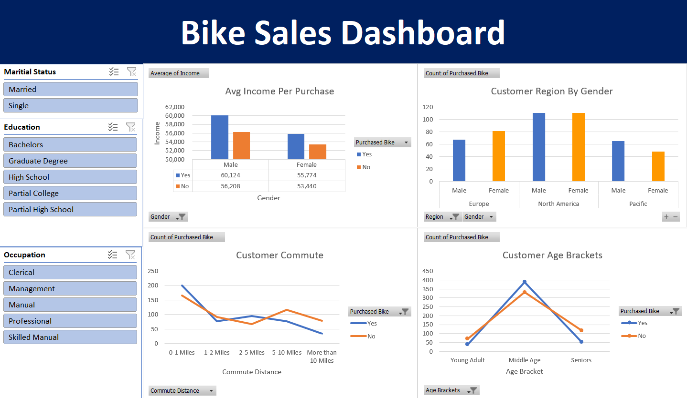

# Bike Sales Market Analysis & Dashboard

## Project Overview
This project focuses on analyzing a dataset of potential bike buyers to understand the key demographics and socioeconomic factors influencing purchasing decisions. The entire data analysis workflow—from raw data cleaning to the creation of a dynamic, interactive dashboard—was executed entirely within Microsoft Excel.

## Dataset
The dataset contains the demographic and background information of potential customers. Key variables include:
* **Demographics:** Marital Status, Gender, Age, Region
* **Socioeconomic Indicators:** Income, Education, Occupation, Home Ownership, Number of Cars
* **Behavioral:** Commute Distance, Purchased Bike (Target Variable)

## Data Cleaning & Feature Engineering
To ensure analytical accuracy, the raw data was preserved, and a dedicated `Working Sheet` was created for data processing. The following transformations were applied:
* **Data Standardization:** Converted shorthand variables (e.g., 'M'/'S' to 'Married'/'Single', 'M'/'F' to 'Male'/'Female') to improve dashboard readability for end-users.
* **Feature Engineering:**
  * Designed custom **Age Brackets** (Young Adult, Middle Age, Seniors) using nested `IF` statements to convert continuous age data into categorical cohorts for trend analysis.
  * Realigned **Commute Distance** string values (e.g., standardizing "10+ Miles") to ensure proper ascending sorting in visualizations.
* **Data Integrity:** Identified and removed duplicate records from the raw dataset to prevent skewed aggregations.

## Interactive Dashboard & Visualization
Using Excel Pivot Tables, an interactive dashboard was developed to extract immediate insights from the data. The dashboard features:
* **Average Income per Purchase:** A clustered column chart comparing the average income of buyers versus non-buyers, segmented by gender.
* **Customer Commute Trends:** Visual tracking of how daily commute distances correlate with the likelihood of purchasing a bike.
* **Customer Age Demographics:** A breakdown of purchasing volume across the custom age brackets.
* **Dynamic Slicers:** The dashboard is connected to interactive slicers for **Marital Status, Region, and Education**. This allows stakeholders to dynamically filter the charts and explore specific market segments on the fly.

## Project Files
* `Edgardo_Martin_Caceres_Portfolio_Excel_Project.xlsx`: The complete workbook containing the raw data, cleaned working sheet, mathematical aggregations (Pivot Tables), and the final interactive dashboard.
